 

 

## 👨‍💻 About Me

- 🚀 AI/ML Engineer focused on **Agentic AI systems**, computer vision, and full-stack ML deployment
- 🧠 Building autonomous agents with **LangChain** & **LangGraph**
- 👁️ Computer vision work with **OpenCV** and **YOLO**
- ⚡ Ship fast, production-ready apps with **FastAPI** and **Streamlit**
- 🧩 250+ problems solved on **LeetCode** — strong foundation in **DSA** & **OOP**
- 📫 Open to collaborating on AI agents, CV pipelines, and backend systems

 

## 🛠️ Tech Stack

**Languages**
 

  

**AI / ML / Computer Vision**
 

  

**Frameworks**
 

  

**Databases**
 

  

**Tools**
 

  

 

## 📊 GitHub Analytics

<!--
  Self-hosted GitHub stats, top languages, and trophies. Generated and
  committed by workflow(s) in .github/workflows/, same pattern as the
  streak card below — local assets instead of the public
  github-readme-stats / github-profile-trophy servers, which were
  breaking before.
-->

 

  

 

## 🐍 Contribution Activity

  <picture>
    <source media="(prefers-color-scheme: dark)" srcset="https://raw.githubusercontent.com/Muhammad-Rehan-Noor-Ul-Huda/Muhammad-Rehan-Noor-Ul-Huda/output/github-contribution-grid-snake-dark.svg" />
    <source media="(prefers-color-scheme: light)" srcset="https://raw.githubusercontent.com/Muhammad-Rehan-Noor-Ul-Huda/Muhammad-Rehan-Noor-Ul-Huda/output/github-contribution-grid-snake.svg" />
    
  </picture>

 

<i>Thanks for stopping by — streak, trophies, and the snake above all update automatically every day 🚀</i>

  

